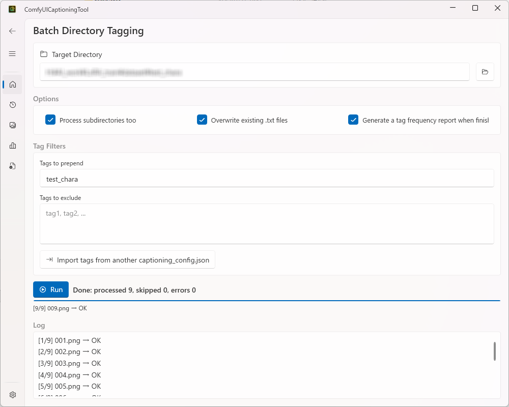
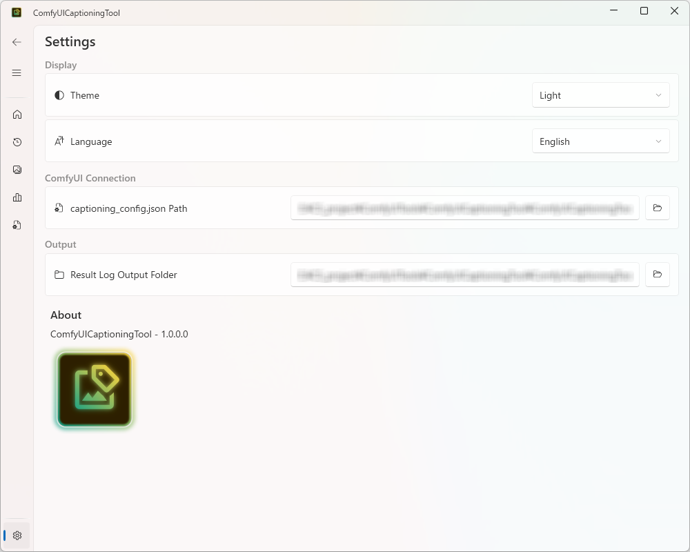
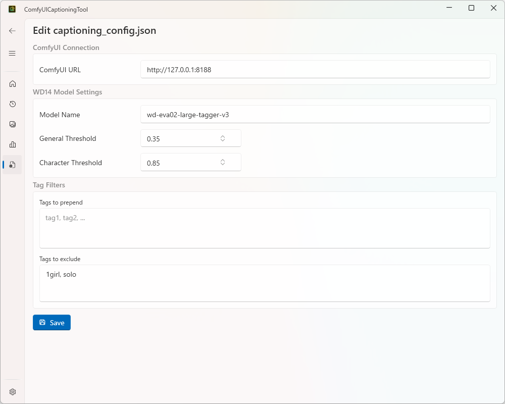
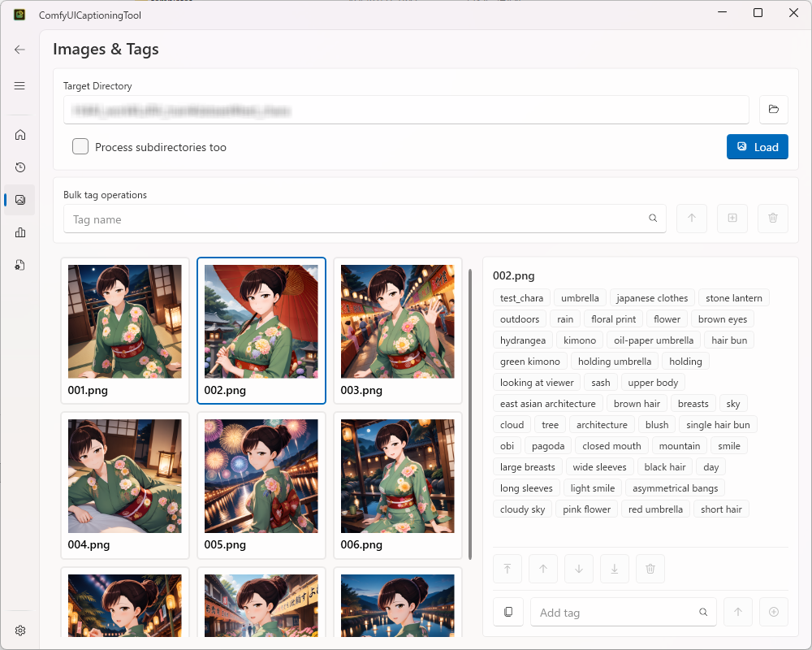

# ComfyUICaptioningTool

✨ [日本語](../README.md)

A tool for image captioning (tagging) using ComfyUI (WD Timm Tagger), operated from a GUI. A C# WPF port of the `captioning_tool` (Python implementation) from [comfyui_tools](https://github.com/satoru634/comfyui_tools).



## Features

- Batch-tag images in a directory with WD14 Tagger, generating a same-named `.txt` caption file for each (supports recursive processing and overwrite)
- Tag filtering via prepend tags and exclude tags (merges the defaults from `captioning_config.json` with the tags entered at run time)
- Import prepend/exclude tags from another `captioning_config.json`
- List of execution results (success/failure, processed count, per-file log)
- Gallery view showing images alongside their tags, with editing (two-pane layout: image tiles + tag editor for the selected image; tag selection and reordering, bulk add/remove, copy a tag list to the clipboard, and an edit history log)
- Generate and view a tag count report (with interactive filtering by tag name, and a list of images using the selected tag)
- Edit `captioning_config.json` (ComfyUI URL, WD14 model name, thresholds, default prepend/exclude tags) directly from the GUI
- Theme switching and persisted connection settings
- Japanese/English display language switching (Settings page, applies immediately, no restart required)

## Quick Start

### Requirements

- Windows 10/11
- [.NET 8 SDK](https://dotnet.microsoft.com/download/dotnet/8.0) (Visual Studio 2022 or later)
- A running [ComfyUI](https://github.com/comfyanonymous/ComfyUI) server

※The following custom node, used by the WD14 Tagger workflow this tool relies on (must be installed on the ComfyUI side beforehand)

- [ComfyUI-WD-Timm-Tagger](https://github.com/bedovyy/ComfyUI-WD-Timm-Tagger)

You'll also need to place the WD14 Tagger workflow template (`templates/template_wd14_tagger.json`) alongside the executable.

### Build & Run

```bash
git clone --recursive https://github.com/satoru634/ComfyUICaptioningTool.git
cd ComfyUICaptioningTool
dotnet run --project ComfyUICaptioningTool
```

### Initial Setup

1. Open the **Settings** page
2. Configure the **captioning_config.json path** and the **results log output folder**



3. If `captioning_config.json` doesn't exist yet at the path you specified, open the **Config** page, enter the ComfyUI URL, WD14 model name, thresholds, and default prepend/exclude tags, then save — the file will be created at that path



### Running Your First Tagging Job

1. On the **Main** page, choose a target directory, and set the recursive/overwrite/generate-report options and prepend/exclude tags as needed
2. Click **Run**
3. Check the results on the **Data** page, and the images and tags on the **Gallery** page



See [usage.md](usage_english.md) for detailed, page-by-page usage instructions.

## Localization

The entire GUI (screen text, messages, navigation menu, etc.) can be switched between Japanese and English.

- How to switch: select "日本語" / "English" from the language selector on the **Settings** page
- When it applies: instantly across every screen as soon as you select it (no app restart required)
- Default language: Japanese (always Japanese on first launch, regardless of the OS locale)
- Your selected language is saved and carried over the next time you start the app

## Tech Stack

| Item | Detail |
|---|---|
| Runtime | .NET 8 / WPF |
| UI framework | Wpf.Ui v4.3.0 |
| MVVM | CommunityToolkit.Mvvm v8.4.2 |
| DI | Microsoft.Extensions.Hosting |
| Shared library | ComfyUILibs (submodule) |

## Project Structure

```
ComfyUICaptioningTool/          ← solution root
  ComfyUILibs/                  ← shared library (submodule)
  ComfyUICaptioningTool/        ← WPF GUI project
  ComfyUICaptioningToolTests/   ← GUI tests
```

## License

See [LICENSE](../LICENSE).
