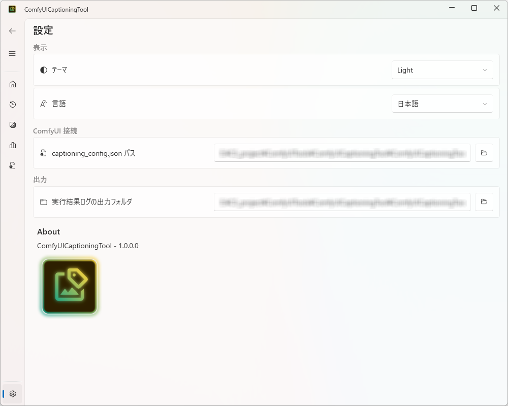
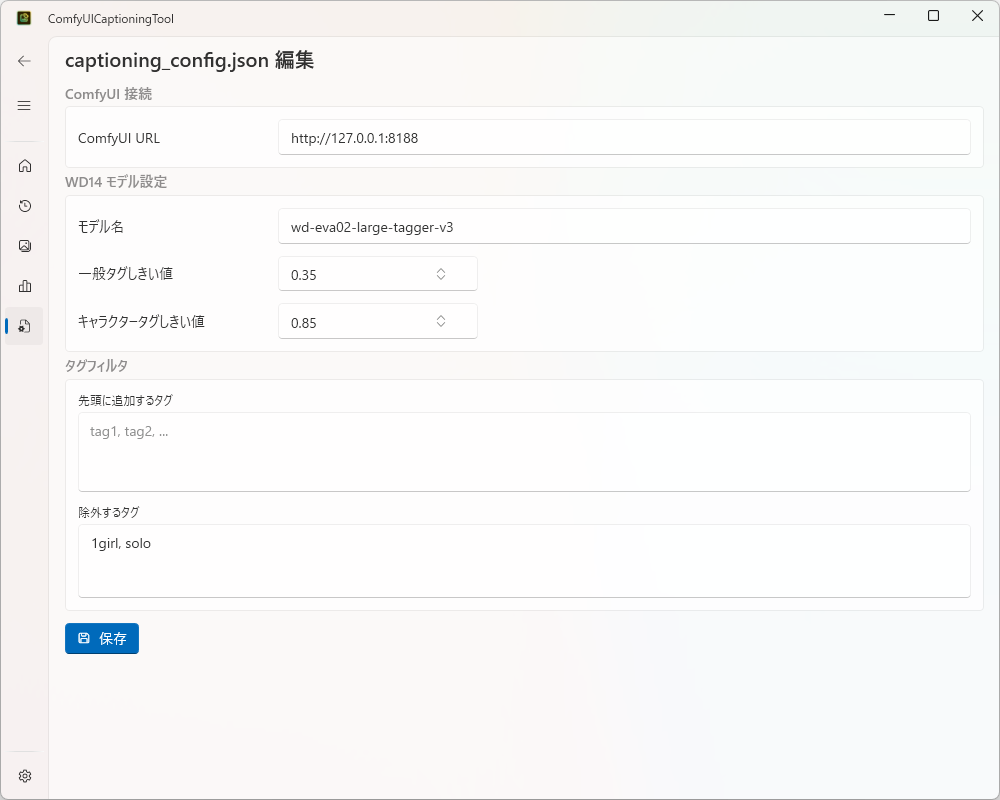
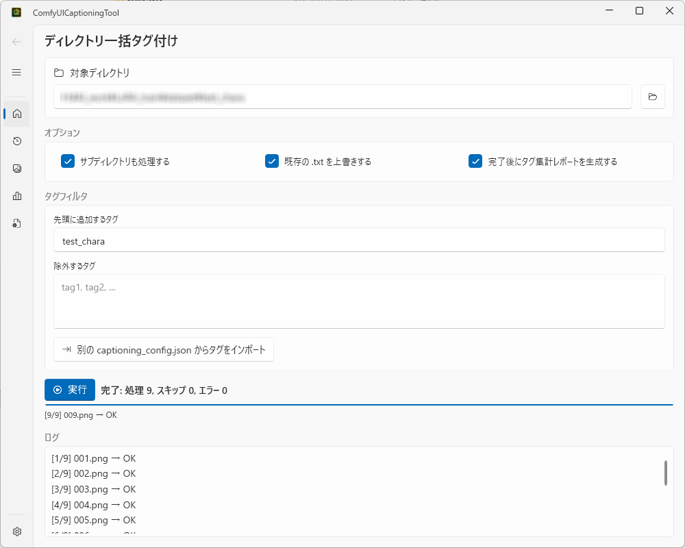
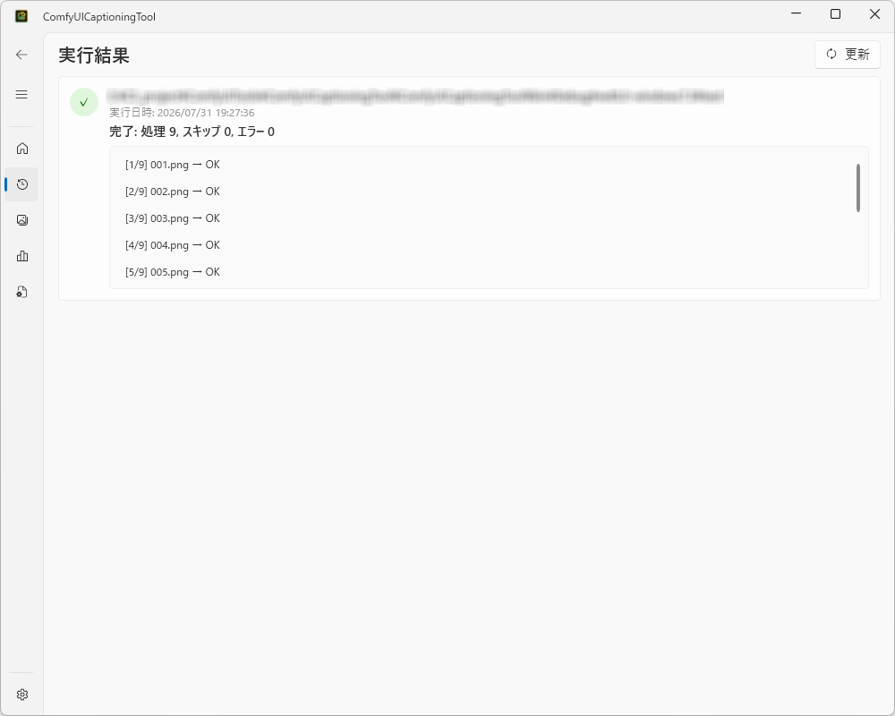
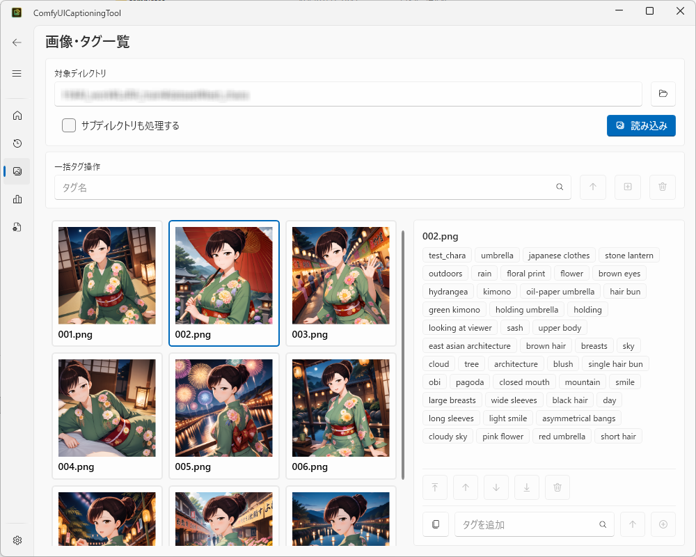
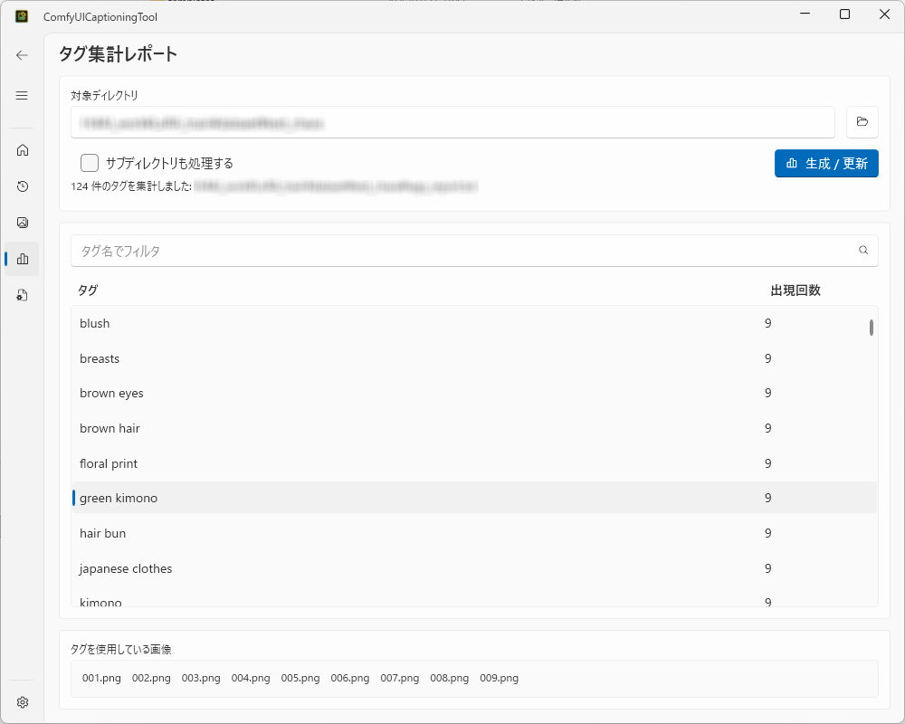

# 使い方ガイド

✨ [English](usage_english.md)

ComfyUICaptioningTool の各画面の詳しい使い方をまとめたガイドです。導入手順の概要は [README.md](../README.md) を参照してください。

## 目次

- [1. 事前準備](#1-事前準備)
- [2. 初回セットアップ](#2-初回セットアップ)
  - [2.1 設定ページ](#21-設定ページ)
  - [2.2 設定ファイルページ（captioning_config.json の編集）](#22-設定ファイルページcaptioning_configjson-の編集)
- [3. ホーム（ディレクトリ一括タグ付け）](#3-ホームディレクトリ一括タグ付け)
- [4. データ（実行結果）](#4-データ実行結果)
- [5. ギャラリー（画像・タグ一覧）](#5-ギャラリー画像タグ一覧)
- [6. タグ集計レポート](#6-タグ集計レポート)
- [7. 表示言語の切り替え](#7-表示言語の切り替え)
- [8. トラブルシューティング](#8-トラブルシューティング)

---

## 1. 事前準備

本ツールを使う前に、以下を用意してください。

- 起動済みの [ComfyUI](https://github.com/comfyanonymous/ComfyUI) サーバー
- ComfyUI に [ComfyUI-WD-Timm-Tagger](https://github.com/bedovyy/ComfyUI-WD-Timm-Tagger) カスタムノードをインストール済みであること
- 本ツールの実行ファイルと同じ階層に `templates/template_wd14_tagger.json`（WD14 Tagger 用ワークフローテンプレート）を配置していること

これらが揃っていない状態でもアプリ自体は起動できますが、「ホーム」ページでのタグ付け実行時に ComfyUI への接続エラーになります。

---

## 2. 初回セットアップ

### 2.1 設定ページ

左のナビゲーションメニューから **設定** を開きます。

このページで設定する項目は次の2つです。

| 項目 | 説明 |
|---|---|
| テーマ | アプリの外観（ライト/ダーク等）を切り替えます |
| 言語 | 表示言語（日本語/English）を切り替えます。詳細は [7. 表示言語の切り替え](#7-表示言語の切り替え) を参照 |
| captioning_config.json パス | ComfyUI の接続先・WD14 モデル設定・タグフィルタの既定値を保持する設定ファイルへのパス。右の 📁 ボタンでファイル選択ダイアログを開いて指定します |
| 実行結果ログの出力フォルダ | 「ホーム」でのタグ付け実行結果（`captioning_result_*.json`）を保存するフォルダ。右の 📁 ボタンでフォルダ選択ダイアログを開いて指定します |

**captioning_config.json パス** と **実行結果ログの出力フォルダ** は、他の全ページの動作の前提になる最も重要な設定です。まずここで両方を指定してください。ファイル/フォルダがまだ存在していなくても構いません（後述の「設定ファイル」ページの保存時、またはタグ付け実行時に自動生成されます）。

### 2.2 設定ファイルページ（captioning_config.json の編集）

左のナビゲーションメニューから **設定ファイル** を開きます。ここでは、2.1 で指定したパスの `captioning_config.json` の中身を GUI から直接編集できます。

| 項目 | 説明 |
|---|---|
| ComfyUI URL | ComfyUI サーバーの URL（例: `http://127.0.0.1:8188`） |
| モデル名 | WD14 Tagger のモデル名（例: `wd-eva02-large-tagger-v3`） |
| 一般タグしきい値 / キャラクタータグしきい値 | タグを採用する確信度の下限（0.0〜1.0）。値が高いほど厳選されたタグのみが付与されます |
| タグフィルタ（先頭に追加するタグ / 除外するタグ） | 「ホーム」でのタグ付け実行時に、常に適用したい既定の prepend/exclude タグ（カンマ区切り）。「ホーム」ページ側の入力欄とは実行のたびにマージされます |

入力後、**保存** ボタンを押すと `captioning_config.json` に書き込まれます。

- ファイルがまだ存在しない場合は保存時に新規作成されます（その旨のメッセージが表示されます）。
- 保存前に ComfyUI URL の未入力・モデル名の未入力・しきい値の範囲外（0.0〜1.0 外）が簡易チェックされ、問題がある場合はエラーメッセージが表示され保存されません。
- このページはファイルの入出力のみを行い、ComfyUI サーバーへの通信は行いません（保存時に接続確認はしません）。

---

## 3. ホーム（ディレクトリ一括タグ付け）

左のナビゲーションメニューの一番上、**ホーム** がメイン画面です。指定したディレクトリ内の画像を WD14 Tagger で一括タグ付けし、画像と同名の `.txt` キャプションファイルを生成します。

### 3.1 操作手順

1. **対象ディレクトリ** の 📁 ボタンでタグ付けしたい画像が入ったフォルダを選択します。対応拡張子は `.jpg` `.jpeg` `.png` `.webp` です。
2. 必要に応じて **オプション** を設定します。
   - **サブディレクトリも処理する**: チェックすると対象ディレクトリ配下のサブフォルダの画像も再帰的に処理します。
   - **既存の .txt を上書きする**: チェックしないと、すでに同名の `.txt` が存在する画像はスキップされます（既存のキャプションを保持したまま未処理の画像だけを処理したい場合はオフのままにします）。
   - **完了後にタグ集計レポートを生成する**: チェックすると、タグ付け完了後に自動で `tags_report.txt`（対象ディレクトリ直下）を生成します。個別に生成したい場合は [6. タグ集計レポート](#6-タグ集計レポート) ページからも生成できます。
3. 必要に応じて **タグフィルタ** を入力します。
   - **先頭に追加するタグ**: 生成される全キャプションの先頭に、カンマ区切りで指定したタグを追加します（例: `masterpiece, best quality`）。
   - **除外するタグ**: WD14 Tagger が検出したタグのうち、カンマ区切りで指定したタグは出力から除外します。
   - どちらも `captioning_config.json` 側の既定値（[2.2](#22-設定ファイルページcaptioning_configjson-の編集) 参照）と**マージ**（既定値が先頭、大文字小文字を区別せず重複除去）されてから使用されます。
   - 📥（インポート）ボタンを押すと、別の `captioning_config.json` ファイルを選択して、その `prepend_tags`/`exclude_tags` を現在の入力欄に追記できます。複数プロジェクト間でタグ設定を使い回したい場合に便利です。
4. **実行** ボタンをクリックします。ボタンは対象ディレクトリ未選択、または `captioning_config.json` が正しく読み込めていない場合は無効化されています。
5. 実行中は進捗バーと `[現在/合計] ファイル名` 形式の進捗テキスト、および1ファイルごとの処理結果ログ（`[1/42] photo.jpg → OK` のような行）が **ログ** 欄に表示されます。各行のステータスは次のいずれかです。

   | ステータス | 意味 |
   |---|---|
   | `OK` | タグ付け成功、`.txt` を出力 |
   | `SKIP` | 既存の `.txt` があり、上書きオプションが無効だったためスキップ |
   | `ERROR` | その画像の処理中にエラーが発生（処理は中断せず次の画像へ続行） |

6. 完了すると `完了: 処理 N, スキップ N, エラー N` の形式でサマリが表示されます。

### 3.2 実行結果として出力されるファイル

タグ付け実行のたびに、以下のファイルが自動的に出力されます（GUI 上で個別に操作する必要はありません）。

| ファイル | 出力先 | 内容 |
|---|---|---|
| `<画像名>.txt` | 各画像と同じフォルダ | その画像のタグ（カンマ区切り） |
| `tags_report.txt` | 対象ディレクトリ直下 | 「完了後にタグ集計レポートを生成する」チェック時のみ。全画像のタグ出現回数集計 |
| `captioning_config_result.json` | 対象ディレクトリ直下 | 成功時のみ。今回実際に使用した設定（ComfyUI URL・モデル名・しきい値・マージ後の prepend/exclude タグ）の記録。次回このファイルを `captioning_config.json` として指定すれば同じ設定を再利用できます |
| `captioning_result_{日時}.json` | 設定ページで指定した「実行結果ログの出力フォルダ」 | 成功/失敗どちらの場合も出力。1 ファイルごとの処理ログ・処理件数・使用した設定をまとめた実行結果ログ（**データ** ページで一覧表示されます） |

---

## 4. データ（実行結果）

左のナビゲーションメニューの **データ** では、[3.2](#32-実行結果として出力されるファイル) で出力される実行結果ログ（`captioning_result_*.json`）を、新しい順に一覧表示します。

各カードには次の情報が表示されます。

- 成功（✓）/ 失敗（✗）のステータスアイコン
- 対象ディレクトリ
- 実行日時
- 成功時: `完了: 処理 N, スキップ N, エラー N` のサマリ／失敗時: エラーメッセージ
- 1 ファイルごとの処理結果ログ（スクロール可能な一覧、カード内に直接表示されるためクリック操作は不要です）

**更新** ボタンを押すと、設定ページで指定した「実行結果ログの出力フォルダ」を再スキャンして最新の状態に更新します（このページに遷移するたびにも自動で再スキャンされます）。

フォルダが未設定・存在しない・結果が 0 件の場合は、それぞれ案内メッセージが表示されます。

---

## 5. ギャラリー（画像・タグ一覧）

左のナビゲーションメニューの **ギャラリー** では、対象ディレクトリ内の画像とタグを並べて確認・編集できます。実行結果とは独立して、任意のディレクトリを都度指定して使えます。

### 5.1 画像の読み込み

1. **対象ディレクトリ** の 📁 ボタンで確認したい画像フォルダを選択します。
2. 必要に応じて **サブディレクトリも処理する** をチェックします。
3. **読み込み** ボタンをクリックすると、対象拡張子（`.jpg` `.jpeg` `.png` `.webp`）の画像がファイル名順にタイル表示されます。同名の `.txt` が存在すればそのタグを、存在しなければ「タグ未生成」として扱います。

画面は左右2ペイン構成です。

- **左ペイン**: 画像タイルの一覧（サムネイル＋ファイル名）。クリックで選択すると枠がアクセントカラーで強調表示されます。
- **右ペイン**: 左ペインで選択中の画像のタグ一覧・編集欄。何も選択していない場合は案内メッセージが表示されます。

### 5.2 カード単位（選択中の画像）のタグ編集

右ペインには選択中の画像のタグがトグルボタンとして並びます。タグ名のボタンをクリックすると選択状態（アクセントカラー表示）になり、複数同時に選択できます。

タグ一覧の下の入力欄と周辺のボタンでタグを編集します。

| ボタン | 動作 |
|---|---|
| 📋（コピー） | 現在のタグ一覧をカンマ区切りでクリップボードにコピー |
| ↑（先頭に追加） | 入力欄の内容をタグの先頭に追加 |
| ＋（末尾に追加） | 入力欄の内容をタグの末尾に追加（Enter キーでも実行可） |
| 🗑（選択タグを削除） | トグルボタンで選択中のタグをまとめて削除。何も選択していない場合は無効化されています |
| ⬆（選択タグを先頭へ） | 選択中のタグを相対順序を保ったままタグ一覧の先頭へまとめて移動。何も選択していない場合は無効化されています |
| ↑（1つ前へ） | 選択中の各タグを1つ前へ移動。連続して選択したタグはひとまとまりのブロックとして移動します |
| ↓（1つ後ろへ） | 選択中の各タグを1つ後ろへ移動 |
| ⬇（選択タグを末尾へ） | 選択中のタグを相対順序を保ったままタグ一覧の末尾へまとめて移動 |

タグの追加・削除は入力するたびに即座に画像と同名の `.txt` へ保存されます（保存ボタンはありません）。タグが 0 件になった場合は `.txt` ファイル自体が削除されます。並び替えボタンも同様に即座に `.txt` へ保存されます。

タグの追加は既存タグと大文字小文字を区別せず重複判定されるため、同じタグを二重に追加することはできません。入力欄はサジェスト機能付き（`ui:AutoSuggestBox`）で、**選択中の画像に既に付いているタグ**を候補表示します（5.3 の一括タグ操作の入力欄が対象ディレクトリ全体の `tags_report.txt` 由来のタグを候補にするのとは異なります）。既存のタグ名をそのまま入力して追加ボタン（先頭/末尾いずれも）を押すと、新規追加ではなくそのタグがトグルボタンで選択された状態に切り替わります（`.txt` 等への書き込みは発生しません）。

また、タグの追加・削除は対象ディレクトリ直下の `captioning_config_result.json`（[3.2](#32-実行結果として出力されるファイル) 参照）にも反映されます。追加したタグは `prepend_tags` に、削除したタグは `exclude_tags` に追記され、次回の一括タグ付け実行時に引き継げます（並び替えのみの操作では反映されません）。

### 5.3 一括タグ操作

対象ディレクトリ選択カードの下にある **一括タグ操作** カードでは、読み込み済みの全画像に対して同じ操作をまとめて行えます。

| ボタン | 動作 |
|---|---|
| ↑（全ての先頭に追加） | 入力欄のタグを読み込み済み全画像のタグの先頭に追加 |
| ＋（全ての末尾に追加） | 入力欄のタグを読み込み済み全画像のタグの末尾に追加 |
| 🗑（全てから削除） | 入力欄のタグと一致する（大文字小文字区別なし）タグを全画像から削除 |

入力欄はサジェスト機能付き（`ui:AutoSuggestBox`）で、対象ディレクトリの `tags_report.txt` から得られたタグ一覧を候補として表示します（候補一覧は画像の読み込み後・タグ編集操作のたびに自動更新されます。`captioning_config.json` パスが未設定の場合は候補が表示されないだけで、他の機能には影響しません）。

### 5.4 作業ログ（gallery_edit_log.jsonl）

カード単位・一括操作を問わず、タグの追加・削除・並び替えを行うたびに、画像と同じフォルダの `gallery_edit_log.jsonl`（JSON Lines 形式、1行1操作で追記）に作業ログが記録されます。GUI 上で内容を確認する画面はありませんが、後から誰が何を編集したかを追跡したい場合にテキストエディタ等で参照できます。

| operation | 意味 |
|---|---|
| `add_start` | タグを先頭に追加 |
| `add_end` | タグを末尾に追加 |
| `remove` | タグを削除 |
| `reorder_to_start` / `reorder_to_end` / `reorder_up` / `reorder_down` | 選択タグの並び替え |

既に先頭/末尾にあるタグを移動しようとした場合など、実質的な変化が無い操作は記録されません。ログの書き込みに失敗した場合も、タグ編集本体（`.txt` の保存等）には影響しません。

---

## 6. タグ集計レポート

左のナビゲーションメニューの **タグ集計レポート** では、指定したディレクトリ内の全画像のタグ出現回数を集計して一覧表示します。

1. **対象ディレクトリ** の 📁 ボタンで集計したいディレクトリを選択します。
2. 必要に応じて **サブディレクトリも処理する** をチェックします。
3. **生成 / 更新** ボタンをクリックすると、対象ディレクトリ直下に `tags_report.txt` を生成し、その内容（タグ名・出現回数）を一覧表示します。
4. 一覧上部の検索欄にタグ名を入力すると、入力した文字列を含むタグ（大文字小文字区別なし・部分一致）だけに一覧が絞り込まれます。検索欄はサジェスト機能付きで、生成済みレポートのタグ一覧を候補表示します。空にすると全件表示に戻ります。
5. 一覧でタグの行をクリックすると、そのタグが付けられている画像のファイル名一覧が下部のカードに表示されます（ファイル名昇順）。未選択の場合は案内メッセージが表示されます。レポートを再生成すると選択状態はリセットされます。

---

## 7. 表示言語の切り替え

**設定** ページの **言語** で「日本語」/「English」を選択すると、画面文言・メッセージ・ナビゲーションメニューを含む GUI 全体の表示言語が、選択と同時に即座に切り替わります（アプリの再起動は不要です）。選択した言語は保存され、次回起動時にも引き継がれます。既定言語は日本語です（OS のロケール設定に関わらず初回起動時は日本語になります）。

---

## 8. トラブルシューティング

| 症状 | 主な原因・対処 |
|---|---|
| **実行** ボタンが押せない（ホームページ） | `captioning_config.json` のパスが未設定、またはファイルの読み込みに失敗しています。設定ページでパスを確認し、必要なら設定ファイルページで内容を修正してください |
| タグ付け実行中に多くの画像が `ERROR` になる | ComfyUI サーバーが起動していない、URL が間違っている、または WD14 Tagger 用カスタムノード／ワークフローテンプレートが未導入の可能性があります。[1. 事前準備](#1-事前準備) を確認してください |
| 「データ」ページに何も表示されない | 設定ページで「実行結果ログの出力フォルダ」が未設定、またはそのフォルダにまだ `captioning_result_*.json` が無い状態です。一度「ホーム」でタグ付けを実行してください |
| 「ギャラリー」の一括タグ操作でサジェスト候補が出ない | `captioning_config.json` のパスが未設定、または対象ディレクトリに `tags_report.txt` がまだ生成されていない可能性があります（候補の欠落は機能自体には影響しません） |
| 設定ファイルページで保存できない | ComfyUI URL が未入力、モデル名が未入力、しきい値が 0.0〜1.0 の範囲外のいずれかです。エラーメッセージに従って入力内容を修正してください |
