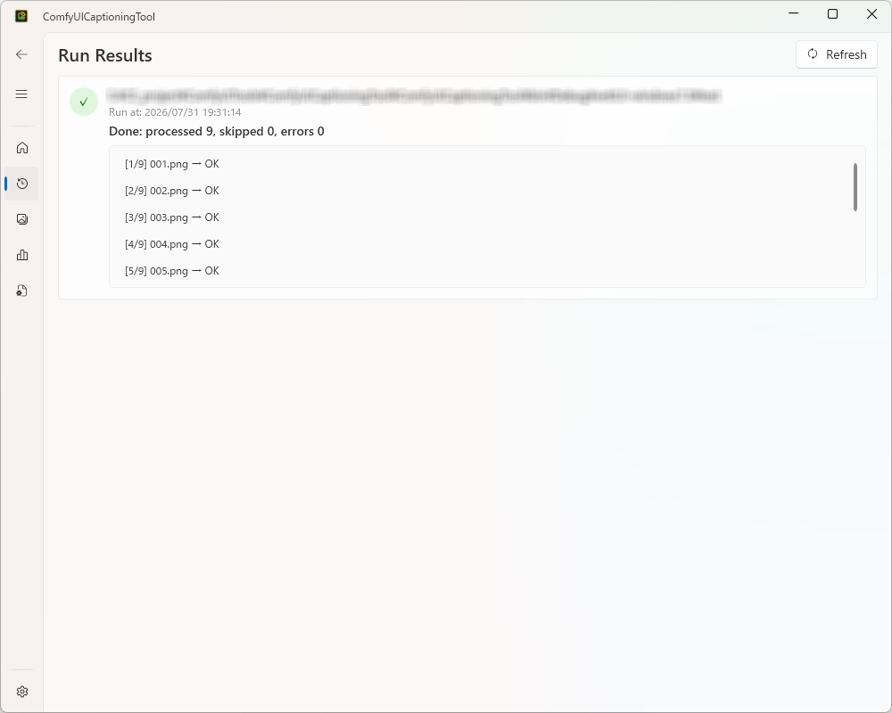
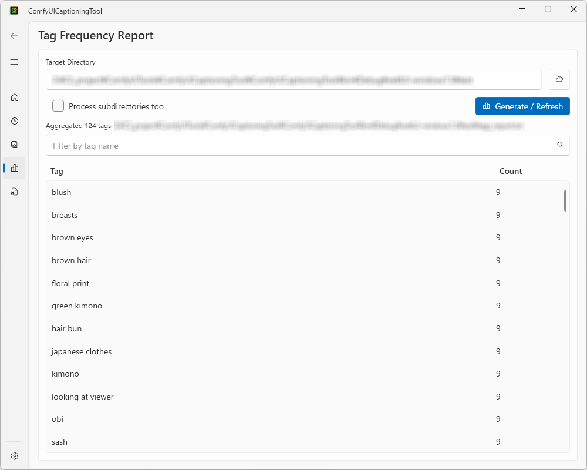

# Usage Guide

✨ [日本語](usage.md)

A detailed guide to every screen in ComfyUICaptioningTool. For a quick overview of setup and installation, see the [README](../README.md).

## Table of Contents

- [1. Prerequisites](#1-prerequisites)
- [2. Initial Setup](#2-initial-setup)
  - [2.1 Settings Page](#21-settings-page)
  - [2.2 Config Page (editing captioning_config.json)](#22-config-page-editing-captioning_configjson)
- [3. Home (Batch Tagging a Directory)](#3-home-batch-tagging-a-directory)
- [4. Data (Run Results)](#4-data-run-results)
- [5. Gallery (Images and Tags)](#5-gallery-images-and-tags)
- [6. Tag Report](#6-tag-report)
- [7. Switching the Display Language](#7-switching-the-display-language)
- [8. Troubleshooting](#8-troubleshooting)

---

## 1. Prerequisites

Before using this tool, make sure you have:

- A running [ComfyUI](https://github.com/comfyanonymous/ComfyUI) server
- The [ComfyUI-WD-Timm-Tagger](https://github.com/bedovyy/ComfyUI-WD-Timm-Tagger) custom node installed on that ComfyUI server
- `templates/template_wd14_tagger.json` (the WD14 Tagger workflow template) placed alongside the app's executable

The app itself will still start without these, but running a tagging job on the **Home** page will fail with a ComfyUI connection error.

---

## 2. Initial Setup

### 2.1 Settings Page

Open **Settings** from the navigation menu on the left.

This page holds the following items:

| Item | Description |
|---|---|
| Theme | Switches the app's appearance (light/dark, etc.) |
| Language | Switches the display language (Japanese/English). See [7. Switching the Display Language](#7-switching-the-display-language) |
| captioning_config.json path | Path to the config file that holds the ComfyUI connection, WD14 model settings, and default tag filters. Use the 📁 button to open a file picker |
| Results log output folder | Folder where tagging run results (`captioning_result_*.json`) from the **Home** page are saved. Use the 📁 button to open a folder picker |

The **captioning_config.json path** and **results log output folder** are the two most important settings — every other page depends on them. Set both here first. Neither the file nor the folder needs to exist yet (the file is created when you save on the Config page or run a tagging job; the folder is created automatically when a result is saved).

### 2.2 Config Page (editing captioning_config.json)

Open **Config** from the navigation menu on the left. This page lets you edit the contents of the `captioning_config.json` file at the path set in 2.1, directly from the GUI.

| Item | Description |
|---|---|
| ComfyUI URL | The ComfyUI server's URL (e.g. `http://127.0.0.1:8188`) |
| Model name | The WD14 Tagger model name (e.g. `wd-eva02-large-tagger-v3`) |
| General threshold / Character threshold | The minimum confidence for a tag to be kept (0.0–1.0). Higher values keep only the most confident tags |
| Tag filter (prepend tags / exclude tags) | Default prepend/exclude tags (comma-separated) that are always applied when tagging from the Home page. These are merged with whatever is entered on the Home page at run time |

Click **Save** to write these values to `captioning_config.json`.

- If the file doesn't exist yet, it will be created on save (a notice is shown).
- Before saving, the form is validated: an empty ComfyUI URL, an empty model name, or a threshold outside 0.0–1.0 will show an error and block the save.
- This page only reads/writes the file — it never talks to the ComfyUI server (saving does not verify connectivity).

---

## 3. Home (Batch Tagging a Directory)

**Home**, at the top of the left navigation menu, is the main screen. It batch-tags every image in a chosen directory using WD14 Tagger and writes a same-named `.txt` caption file for each one.

### 3.1 Steps

1. Click the 📁 button next to **Target Directory** and pick the folder containing the images you want to tag. Supported extensions: `.jpg`, `.jpeg`, `.png`, `.webp`.
2. Set the **Options** as needed.
   - **Process subdirectories too**: recursively processes images in subfolders of the target directory.
   - **Overwrite existing .txt files**: if left unchecked, images that already have a matching `.txt` are skipped (leave this off to keep existing captions and only process new images).
   - **Generate a tag count report when done**: automatically generates `tags_report.txt` (directly under the target directory) after tagging finishes. You can also generate it separately from the [Tag Report](#6-tag-report) page.
3. Enter **tag filters** as needed.
   - **Tags to prepend**: a comma-separated list of tags added to the front of every generated caption (e.g. `masterpiece, best quality`).
   - **Tags to exclude**: a comma-separated list of tags to strip out of what WD14 Tagger detects.
   - Both are **merged** with the defaults from `captioning_config.json` (see [2.2](#22-config-page-editing-captioning_configjson)) before use — the defaults come first, and duplicates are removed case-insensitively.
   - Click the import (📥) button to pick another `captioning_config.json` file and append its `prepend_tags`/`exclude_tags` to the current input fields — handy for reusing tag setups across projects.
4. Click **Run**. The button is disabled until a target directory is chosen and `captioning_config.json` has been loaded successfully.
5. While running, a progress bar, a `[current/total] filename` progress line, and a per-file log entry (like `[1/42] photo.jpg → OK`) appear in the **Log** panel. Each entry's status is one of:

   | Status | Meaning |
   |---|---|
   | `OK` | Tagging succeeded; a `.txt` file was written |
   | `SKIP` | A `.txt` already existed and overwrite was off, so the image was skipped |
   | `ERROR` | An error occurred while processing this image (processing continues with the next image) |

6. When finished, a summary in the form `Completed: processed N, skipped N, errors N` is shown.

### 3.2 Files Produced by a Run

Each tagging run automatically produces the following files — no manual action is needed:

| File | Location | Contents |
|---|---|---|
| `<image>.txt` | Same folder as each image | That image's tags (comma-separated) |
| `tags_report.txt` | Directly under the target directory | Only when "Generate a tag count report when done" is checked. Tag occurrence counts across all images |
| `captioning_config_result.json` | Directly under the target directory | Only on success. A record of the settings actually used this run (ComfyUI URL, model name, thresholds, merged prepend/exclude tags). Point `captioning_config.json` at this file next time to reuse the same settings |
| `captioning_result_{timestamp}.json` | The "results log output folder" set on the Settings page | Written on both success and failure. A combined run log — per-file processing log, counts, and the settings used (shown in the **Data** page) |

---

## 4. Data (Run Results)

**Data**, in the left navigation menu, lists the run result logs (`captioning_result_*.json`) described in [3.2](#32-files-produced-by-a-run), newest first.

Each card shows:

- A success (✓) / failure (✗) status icon
- The target directory
- The run timestamp
- On success: a `Completed: processed N, skipped N, errors N` summary; on failure: the error message
- The per-file processing log (a scrollable list shown directly in the card — no extra click needed)

Click **Refresh** to rescan the "results log output folder" set on the Settings page (this also happens automatically every time you navigate to this page).

If the folder isn't set, doesn't exist, or has no results yet, a corresponding message is shown instead.

---

## 5. Gallery (Images and Tags)

**Gallery**, in the left navigation menu, lets you view and edit images alongside their tags. It works independently of run results — just pick any directory each time.

### 5.1 Loading Images

1. Click the 📁 button next to **Target Directory** and choose the image folder you want to inspect.
2. Check **Process subdirectories too** if needed.
3. Click **Load** — images with a supported extension (`.jpg`, `.jpeg`, `.png`, `.webp`) are shown as tiles, sorted by filename. If a matching `.txt` exists its tags are shown; otherwise the image is marked as untagged.

The screen is a two-pane layout:

- **Left pane**: a grid of image tiles (thumbnail + filename). Click a tile to select it; the selected tile's border is highlighted in the accent color.
- **Right pane**: the tag list and editing controls for whichever image is selected on the left. A prompt message is shown when nothing is selected.

### 5.2 Editing Tags for the Selected Image

The right pane shows the selected image's tags as toggle buttons. Clicking a tag name toggles its selection (highlighted in the accent color); multiple tags can be selected at once.

Use the input field and buttons below the tag list to edit tags.

| Button | Action |
|---|---|
| 📋 (Copy) | Copies the current tag list to the clipboard, comma-separated |
| ↑ (Add to start) | Adds the input field's content to the start of the tag list |
| ＋ (Add to end) | Adds the input field's content to the end of the tag list (Enter key also works) |
| 🗑 (Remove selected) | Removes all currently selected (toggled) tags at once. Disabled when nothing is selected |

Every add/remove is saved immediately to the image's same-named `.txt` file — there's no separate save button. If a tag list becomes empty, the `.txt` file itself is deleted.

Adding a tag checks for duplicates case-insensitively, so the same tag can't be added twice.

Tag add/remove operations are also reflected in the `captioning_config_result.json` file in the target directory (see [3.2](#32-files-produced-by-a-run)): added tags are appended to `prepend_tags`, removed tags to `exclude_tags`, so the next batch-tagging run can pick them up.

### 5.3 Bulk Tag Operations

The **Bulk Tag Operations** card, below the directory selection card, lets you apply the same operation to every loaded image at once.

| Button | Action |
|---|---|
| ↑ (Add to start of all) | Adds the input field's tag to the start of every loaded image's tags |
| ＋ (Add to end of all) | Adds the input field's tag to the end of every loaded image's tags |
| 🗑 (Remove from all) | Removes any tag matching the input field (case-insensitive) from every image |

The input field offers suggestions (via `ui:AutoSuggestBox`), populated from the target directory's `tags_report.txt` (the suggestion list refreshes automatically after loading images and after each tag edit; if `captioning_config.json`'s path isn't set, suggestions simply won't appear — nothing else is affected).

---

## 6. Tag Report

**Tag Report**, in the left navigation menu, tallies how many times each tag appears across all images in a chosen directory.

1. Click the 📁 button next to **Target Directory** and choose the directory to analyze.
2. Check **Process subdirectories too** if needed.
3. Click **Generate / Refresh** — this writes `tags_report.txt` directly under the target directory and lists its contents (tag name and count).
4. Type into the search box above the list to filter it down to tags containing that text (case-insensitive substring match). The search box offers suggestions from the generated report's tag list. Clear it to show all tags again.

---

## 7. Switching the Display Language

Selecting "日本語" / "English" from **Language** on the **Settings** page instantly switches the entire GUI's display language — screen text, messages, navigation menu, everything — the moment you choose it (no app restart needed). Your selection is saved and carried over to the next launch. The default language is Japanese (always Japanese on first launch, regardless of the OS locale).

---

## 8. Troubleshooting

| Symptom | Likely cause / fix |
|---|---|
| The **Run** button on the Home page is disabled | The `captioning_config.json` path isn't set, or the file failed to load. Check the path on the Settings page, and fix the file's contents on the Config page if needed |
| Many images end up as `ERROR` during a tagging run | The ComfyUI server may not be running, the URL may be wrong, or the WD14 Tagger custom node / workflow template may not be installed. See [1. Prerequisites](#1-prerequisites) |
| The Data page shows nothing | The "results log output folder" isn't set on the Settings page, or no `captioning_result_*.json` files exist there yet. Run a tagging job from the Home page first |
| No suggestions appear for bulk tag operations on the Gallery page | The `captioning_config.json` path may not be set, or `tags_report.txt` hasn't been generated yet for the target directory (missing suggestions don't affect the feature itself) |
| Can't save on the Config page | Either the ComfyUI URL is empty, the model name is empty, or a threshold is outside 0.0–1.0. Fix the input according to the error message shown |
